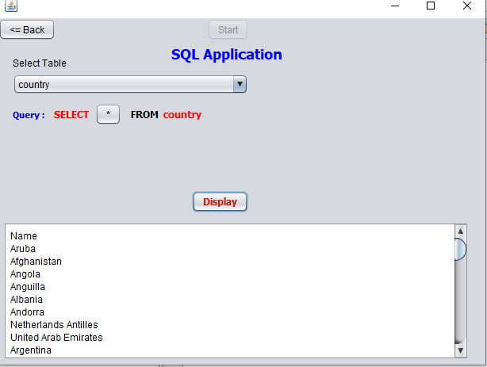

# SQL_APP
A GUI Query Interface For SQL.
 It is useful for those who wants to access data without haveing a knowledge of SQL.
 Features:
* Can select database.
* Select table for quering.
* Can select multiple columns from table.
  Below are some screenshots:
 

